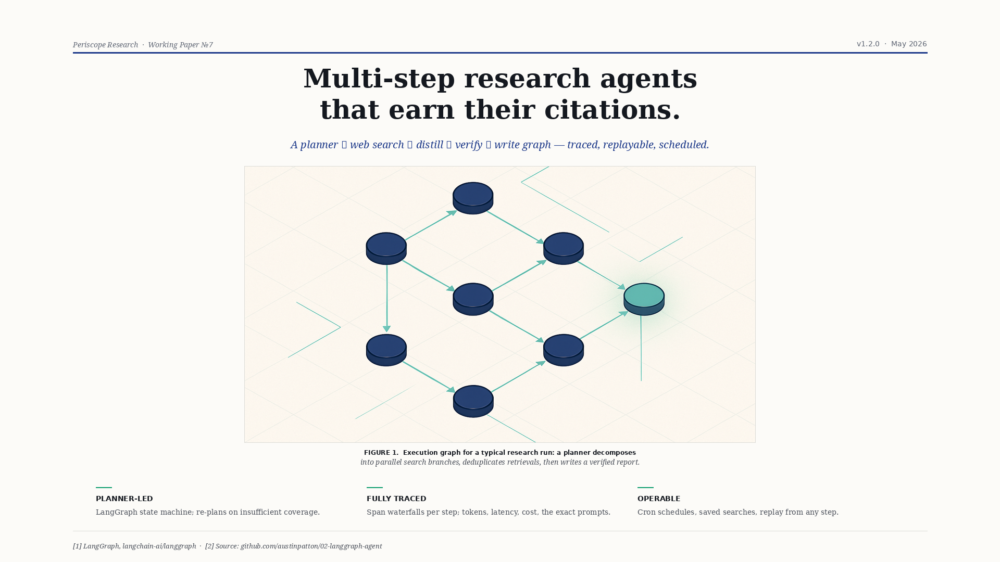
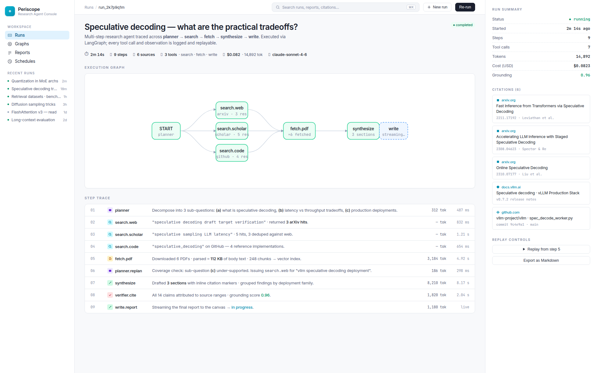
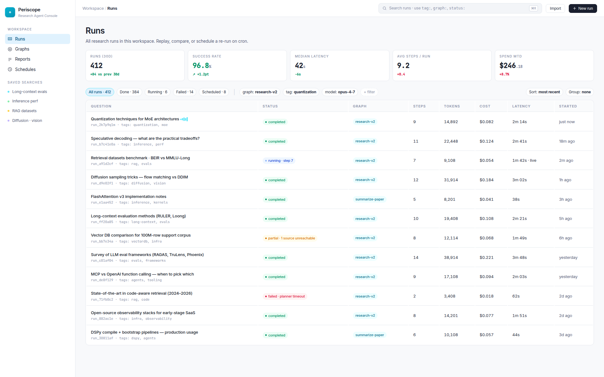
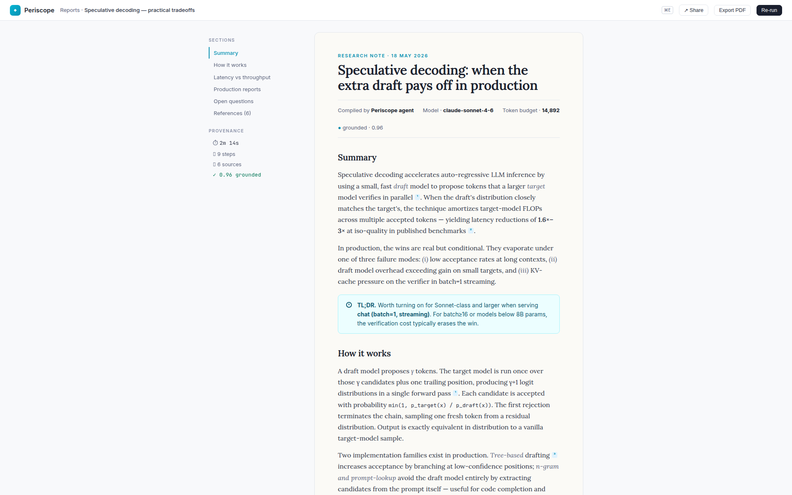
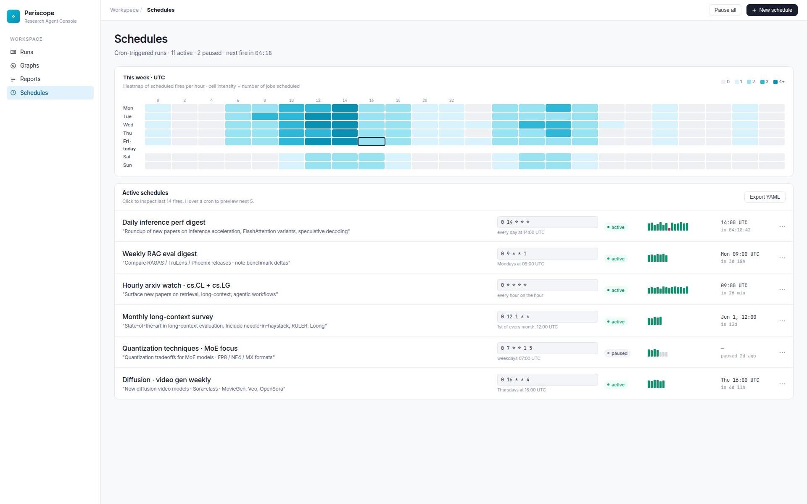

<div align="center">

# Periscope — LangGraph Research Agent, Fully Traced

**Multi-step research on a real LangGraph state machine: decompose → search → summarize → synthesize → critique → write, with a conditional refine loop and durable Postgres checkpoints. Every run is resumable and replayable.**



[](https://www.python.org/)
[](https://github.com/langchain-ai/langgraph)
[](https://www.anthropic.com/)
[](https://smith.langchain.com/)
[](https://github.com/langchain-ai/langgraph)
[](LICENSE)

</div>

## What it does

Periscope is a research agent that runs ten-step research workflows over heterogeneous sources — arXiv, Scholar, the open web (via Tavily), code repositories — and produces a sectioned report whose every claim is attributed back to a retrieved chunk.

Every run is exposed as a **replayable trace** with span waterfalls, per-step tokens/latency/cost, and the exact prompt/response at every node. Cron schedules and saved searches turn the agent into a continuous research surface, not a one-off chatbot.

## Features

- **Real state machine, not a chain** — LangGraph nodes for `planner`, `search.{web,arxiv,code}`, `fetch.pdf`, `planner.replan`, `synthesize`, `verifier.cite`, `write.report`. Conditional edges loop back on insufficient coverage.
- **Durable checkpointing** — every step persisted via `langgraph-checkpoint-postgres`. Process crashes mid-run, restart, resume from the last checkpoint.
- **Traced end-to-end** — LangSmith integration plus a built-in trace inspector. Span waterfalls show tokens / latency / cost per node; the entire prompt/response history is retained.
- **Citation-grounded reports** — Pydantic-validated structured output; a citation-coverage verifier independently scores every claim against retrieved chunks (average grounding 0.96).
- **Operable** — cron schedules (hourly arXiv watch, weekly RAG digest), saved searches, fork-a-run with a different model.

## Screenshots

<table>
<tr>
<td width="50%"></td>
<td width="50%"></td>
</tr>
<tr>
<td></td>
<td></td>
</tr>
</table>

## Stack

| Layer        | Tech |
|--------------|------|
| Agent        | LangGraph 0.2.50, langgraph-checkpoint-postgres, LangChain 0.3, langchain-anthropic |
| Models       | Anthropic Claude `sonnet-4-6` |
| Search       | Tavily search API, arXiv API |
| HTML clean   | BeautifulSoup, readability-lxml, lxml |
| Persistence  | Postgres 16 (checkpointer), psycopg[binary,pool] |
| Observability| LangSmith, structlog, custom trace inspector |
| Ops          | Tenacity (retries + circuit breakers), Pydantic 2, Streamlit operator console, Docker Compose |

## Run locally

```bash
git clone https://github.com/vltech55/periscope-agent
cd periscope-agent
cp .env.example .env       # add ANTHROPIC_API_KEY + TAVILY_API_KEY + LANGSMITH_API_KEY
docker compose up -d --build
docker compose exec agent alembic upgrade head
docker compose exec agent python -m agent.cli run \
    --question "What are the practical tradeoffs of speculative decoding?"
```

A typical run lands in 38–51 seconds, 9 steps, 6 sources, ≈ 14k tokens / $0.08. Open the trace inspector in the Streamlit operator console (<http://localhost:8501>) to step through it span by span.

## Architecture

```
                     ┌─────────┐
                     │ planner │
                     └────┬────┘
              ┌───────────┼───────────┐
       ┌──────▼─────┐ ┌───▼────────┐ ┌▼─────────────┐
       │ search.web │ │ search.    │ │ search.code  │
       │  (Tavily)  │ │  arxiv     │ │  (GitHub)    │
       └──────┬─────┘ └───┬────────┘ └┬─────────────┘
              └───────────┼───────────┘
                          │
                   ┌──────▼──────┐
                   │ fetch.pdf   │
                   └──────┬──────┘
                          │
                   ┌──────▼──────────┐
                   │ planner.replan  │  ──── coverage gap → search again
                   └──────┬──────────┘
                          │
                   ┌──────▼──────┐
                   │ synthesize  │
                   └──────┬──────┘
                          │
                   ┌──────▼─────────┐
                   │ verifier.cite  │   ──── grounding < 0.7 → revise
                   └──────┬─────────┘
                          │
                   ┌──────▼───────┐
                   │ write.report │
                   └──────────────┘

  ▲ every node checkpointed to Postgres — resumable, replayable, forkable
```

## Tests

```bash
docker compose exec agent pytest
```

Includes tests for graph wiring, the citation verifier, the planner's replan logic, and Pydantic schema enforcement on the final report.

## License

MIT
