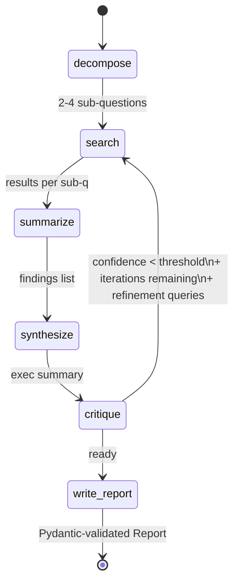

# Architecture

## Why a state machine, not a chain

A linear chain has no place to express "if the synthesis is weak, go back to
the search step with different queries." A state machine does. LangGraph
makes the routing decision explicit (`graph/routing.py`) and the state
inspectable at every step via the checkpointer.

## State persistence

LangGraph's `AsyncPostgresSaver` persists state after every node transition,
keyed by `thread_id`. Three consequences:

1. A run interrupted by an exception or container restart can resume from
   the last successful node.
2. The UI can replay any past run by re-reading the checkpointer.
3. Tests against the routing logic can construct synthetic states and assert
   on the conditional-edge behavior without touching the LLM.

If Postgres is unreachable at startup the graph falls back to `MemorySaver`,
so the demo still works in environments without a database. This is logged
at warning level.

## Pluggable search backend

`SearchTool` is a `Protocol` with three implementations selected by
`SEARCH_PROVIDER`:

| Provider | Needs key | Use case                                  |
| -------- | --------- | ----------------------------------------- |
| `tavily` | yes       | Production-quality web search             |
| `ddg`    | no        | No-key dev/demo; rate-limited HTML scrape |
| `mock`   | no        | Deterministic local corpus; tests & CI    |

Nodes only see the `SearchTool` interface; they never branch on provider.
This is how the agent ships before you have a Tavily key — and how the test
suite runs without internet.

## Circuit breaker

External search calls go through `CircuitBreaker.call`. After
`CIRCUIT_BREAKER_FAILURES` consecutive failures the breaker opens; further
calls raise `CircuitOpenError` and the node falls through to a local
`MockSearchTool`, so a single dead provider doesn't kill the whole run.
The breaker auto-half-opens after a 30-second cooldown.

## Why decompose → search → summarize before synthesize

Synthesizing across raw search results trades off recall for hallucination
risk. By forcing a per-sub-question summarize step with explicit
`Finding(claim, citations)` Pydantic validation, every claim that ends up
in the final report is already grounded in at least one source. The
synthesize step then operates on validated findings, not raw text.

## Trace observability

When `LANGCHAIN_TRACING_V2=true` and `LANGCHAIN_API_KEY` is set, every node
invocation is sent to LangSmith with full input/output and latency. Without
those vars set, traces are no-ops (the `ChatAnthropic` client picks up the
env at init time).
